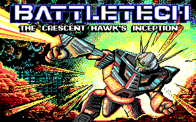
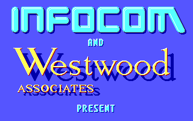

# Reko-Btech
 Crescent Hawks: Inception Decompilation

Reko decompilation project files for decompilation of Crescent Hawks: Inception.
An 16-bit MS-DOS game from 1988 based in the BattleTech universe.

This decompilation is an educational breakdown of the application to investigate game design principles of the era, gain further understanding of the application and it's data structures.  

The project will also provide insight into games designed around the time period of CGA, VGA, Tandy and MCGA graphics options.

There is no copyright content contained within the repository and the files in this repository cannot be used to run the btech.exe application.

If you wish to follow along or use these decompilation project files you will need to own a legal copy of the
Crescent Hawks: Inception EXE and associated data files.

-----

[Image File Encoding](Documentation/FileEncoding.md)
